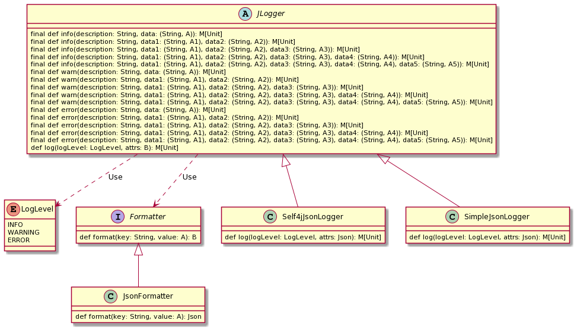

## jlogger

This is a Scala library to print the log in JSON format

### Installation

Add the following dependency to you `build.sbt`

```scala
  libraryDependencies += "io.github.sjmyuan" %% "jlogger" % "0.0.2",
```

### UML



### Example

#### Print log with self4j

```scala
import io.github.sjmyuan.jlogger.SimpleJsonLogger
import cats.effect.IO
import cats.effect.IOApp
import org.slf4j.LoggerFactory

object App extends IOApp {
    val logger = new Self4jJsonLogger[IO](LoggerFactory.getLogger(getClass()))

    val program = for {
      _ <-logger.warn("This is a json logger")
      _ <-logger.error("This is a json logger")
      _ <-logger.info("This is a json logger")
    } yield()

    program.unsafeRunSync()
}
```

#### Print log with println

```scala
import io.github.sjmyuan.jlogger.SimpleJsonLogger
import cats.effect.IO
import cats.effect.IOApp

object App extends IOApp {
    val logger = new SimpleJsonLogger[IO]()

    val program = for {
      _ <-logger.warn("This is a json logger")
      _ <-logger.error("This is a json logger")
      _ <-logger.info("This is a json logger")
    } yield()

    program.unsafeRunSync()
}
```
